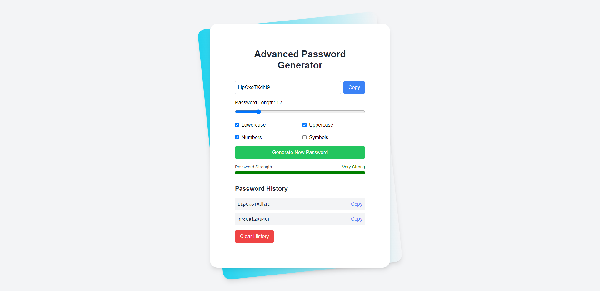

<div align="center">
  <br />
      
  <br />

  <div>
    
    
  </div>

  <h3 align="center">Generate Copy Custom Password</h3>

</div>

## 📋 <a name="table">Table of Contents</a>

1. 🤖 [Introduction](#introduction)
2. ⚙️ [Tech Stack](#tech-stack)
3. 🔋 [Features](#features)
4. 🤸 [Quick Start](#quick-start)

## <a name="introduction">🤖 Introduction</a>

This mini project is a Random Password Generator built with React, utilizing the useEffect, useRef, and useCallback hooks for optimal performance. The application allows users to generate secure, random passwords with customizable options, ensuring both flexibility and security.

## <a name="tech-stack">⚙️ Tech Stack</a>

- React.js
- Vite
- Tailwind CSS

## <a name="features">🔋 Features</a>

👉 **Generate Random Passwords:**: Users can generate a strong password by clicking a button. The password is randomly created based on user-defined criteria.

👉 **Copy to Clipboard:**: Once a password is generated, users can easily copy it to their clipboard with a simple click, making it convenient to use in various applications.

👉 **Customization Options:**: 
Length: Users can set the desired password length, with a minimum of 8 characters.
Include Numbers: An option to include or exclude numbers in the generated password.
Include Special Characters: Users can choose to incorporate special characters for added complexity.

## <a name="quick-start">🤸 Quick Start</a>

Follow these steps to set up the project locally on your machine.

**Prerequisites**

Make sure you have the following installed on your machine:

- [Git](https://git-scm.com/)
- [Node.js](https://nodejs.org/en)
- [npm](https://www.npmjs.com/) (Node Package Manager)

**Cloning the Repository**

```bash
git clone https://github.com/ajeet8395/Generate-Copy-Custom-Password
cd Generate-Copy-Custom-Password
```

**Installation**

Install the project dependencies using npm:

```bash
npm install
```

**Running the Project**

```bash
npm run dev
```

Open [http://localhost:5173](http://localhost:5173) in your browser to view the project.
